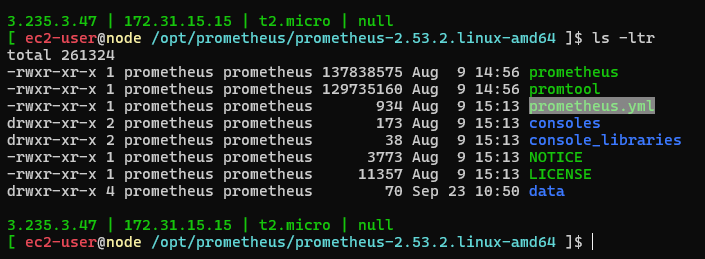
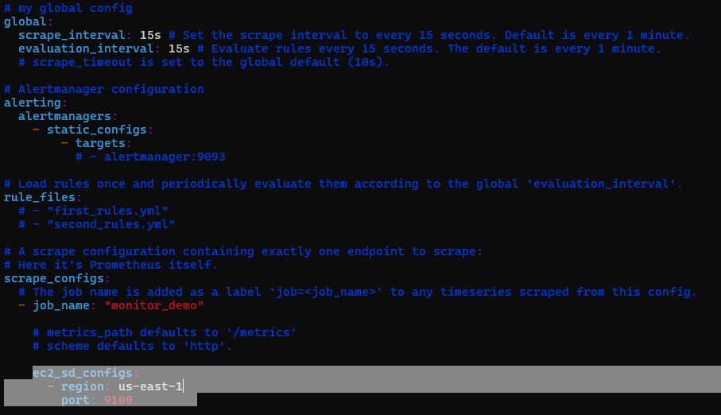
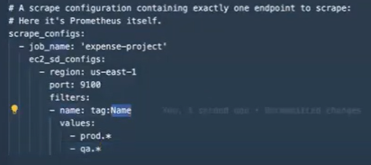

# Monitoring

Monitoring is to get the insights of the performace and beahviour of the infrastructure/application.

APM tools: Application monitoring tools 
Infrastructure monitoring tools : promethues

4 golden signals for SRE : https://sre.google/sre-book/monitoring-distributed-systems/#:~:text=The%20four%20golden%20signals%20of,system%2C%20focus%20on%20these%20four.

NOC team

1.) Latency
2.) traffic
3.) Erros
4.) saturation

promethues require a agent running on the node machine to get the data.

so we require a dedicated machine where the promethues is installed.
Agents are installed on the machines which we want to monitor and these will send the metrics to the master machine for visbilty.

so depending upon the metrics we want we should install the required type of exporter.

so there are many exporters to provide us with various metrics for specific machines.

Promethues: there will be no authentication when accessing the GUI of the promethues as it doesnt provide any information.

for any application/software we are installing it is required to install with a service account/user profile.

-----------------------------------------------------------------------------------------

if id "prometheus" &>/dev/null; then
    echo "User 'prometheus' already exists."
else
    sudo useradd prometheus
    echo "User 'prometheus' has been created."
fi

-----------------------------------------------------------------------------------------

### service

[Unit]
Description = Prometheus Service

[Service]
User=prometheus
WorkingDirectory=/opt/prometheus-2.53.2.linux-amd64
ExecStart=/opt/prometheus-2.53.2.linux-amd64/prometheus
SyslogIdentifier=prometheus

[Install]
WantedBy=multi-user.target

-------------------------------------------------------------------------------------------

#### steps to install and configure the promethues

if id "prometheus" &>/dev/null; then
    echo "User 'prometheus' already exists."
else
    sudo useradd prometheus
    echo "User 'prometheus' has been created."
fi

mkdir /opt/Prometheus

sudo chown -R prometheus:prometheus /opt/prometheus

cd /opt/prometheus

wget https://github.com/prometheus/prometheus/releases/download/v2.53.2/prometheus-2.53.2.linux-amd64.tar.gz

unzip prometheus-2.53.2.linux-amd64.tar.gz

sudo chown -R prometheus:prometheus /opt/Prometheus

sudo chmod -R 755 /opt/Prometheus

cd /etc/systemd/system

sudo touch prometheus.service 

sudo vim prometheus.service

[Unit]
Description = Prometheus Service

[Service]
User=prometheus
WorkingDirectory=/opt/prometheus/prometheus-2.53.2.linux-amd64
ExecStart=/opt/prometheus/prometheus-2.53.2.linux-amd64/prometheus
SyslogIdentifier=prometheus

[Install]
WantedBy=multi-user.target

--------------------------------------------------------------------------------------------------------------------------------------------------------------------------

9000 default port for promethues

9100 for the exporters.

--------------------------------------------------------------------------------------------------------------------------------------------------------------------------
#### steps to install and configure the node_exporter

wget https://github.com/prometheus/node_exporter/releases/download/v1.8.2/node_exporter-1.8.2.linux-amd64.tar.gz

after the downloading the zip file.

unzip the zip file tar -xf

in the below image prometheus.yml is where we mention what nodes.machines to get the metrics from.

prometheus.yml file contents:

#my global config
global:
  scrape_interval: 15s # Set the scrape interval to every 15 seconds. Default is every 1 minute. 

scrape interval is after how much time the metrics should be collected.

  evaluation_interval: 15s # Evaluate rules every 15 seconds. The default is every 1 minute.
  #scrape_timeout is set to the global default (10s).

#Alertmanager configuration
alerting:
  alertmanagers:
    - static_configs:
        - targets:
          # - alertmanager:9093

#Load rules once and periodically evaluate them according to the global 'evaluation_interval'.
rule_files:
  #- "first_rules.yml"
  #- "second_rules.yml"

#A scrape configuration containing exactly one endpoint to scrape:
#Here it's Prometheus itself.
scrape_configs:
  #The job name is added as a label `job=<job_name>` to any timeseries scraped from this config.
  - job_name: "prometheus"

    #metrics_path defaults to '/metrics'
    #scheme defaults to 'http'.

    static_configs:
      - targets: ["localhost:9090"] this is a list and this is where we add the systemip and the port to get the metrics from

example: targets: ["localhost:9090", "172.56.47.32:9100"] here providing the IPs with ports as targets is not very practical incase of dynamic infrastructure as we cant add new IPs everytime a new instance is created.

so there is a concept called service discovery mechanism.

as per the above screenshot we can see the below

ec2_sd_configs:
  - region: us-east-1
    port: 9100

where we are telling the prometheus to use the port 9100 to monitor the metrics from all the instances present in the us-east-1 location. so this is a practical way to get all the metrics from all the active infrastructure in our account. but, there is a catch "we have to attach a IAM role to this prometheus installed VM so that it can read all the active infrastructure possible."

we can even us tags as filer for monitoring as below picture

--------------------------------------------------------------------------------------------------------------------------------------------------------------------------

how to see the metrics offered 

curl 172.31.1.183(IP of the target):9100(port of the target)/metrics

When to Use Lifecycle Policies of terraform:

Use create_before_destroy when you have resources that should not experience downtime.
Use prevent_destroy for critical resources that need extra protection against accidental deletion.
Use ignore_changes when external changes to resource attributes should not trigger Terraform updates.